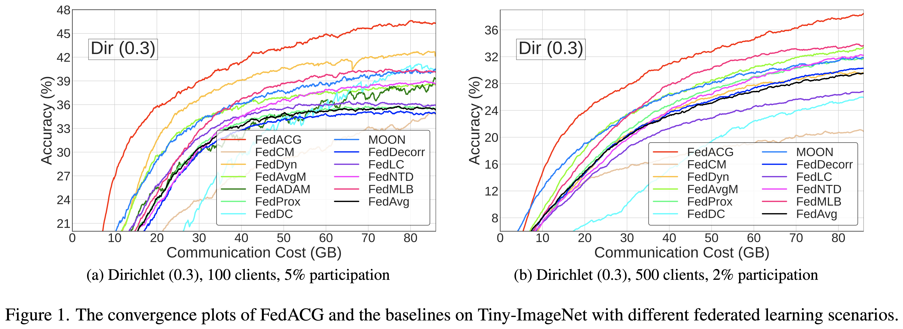

# Communication-Efficient Federated Learning with Accelerated Client Gradient


<p align="center">
    <a href="https://cvpr.thecvf.com/virtual/2024/poster/31583"></a>
    <a href="https://arxiv.org/abs/2201.03172"></a>
    <a href="http://cvlab.snu.ac.kr/research/FedACG/"></a>

[//]: # (  <a href="https://github.com/CVMI-Lab/SlotCon/blob/master/LICENSE"></a>)
</p>
<p align="center">
	Official pytorch implementation of Communication-Efficient Federated Learning <br>with Accelerated Client Gradient (CVPR 2024)<br>
  By
  <a href="https://geehokim.github.io./">Geeho Kim</a>*, 
  <a href="https://jinkyu032.vercel.app/">Jinkyu Kim</a>*, and 
  <a href="https://cv.snu.ac.kr/index.php/bhhan/">Bohyung Han</a>
  (* equal contribution).
    
</p>


<center>

</center>

Federated learning often suffers from slow and unstable convergence due to the heterogeneous characteristics of participating client datasets.
Such a tendency is aggravated when the client participation ratio is low since the information collected from the clients has large variations.
To address this challenge, we propose a simple but effective federated learning framework, which improves the consistency across clients and facilitates the convergence of the server model.
This is achieved by making the server broadcast a global model with a lookahead gradient.
This strategy enables the proposed approach to convey the projected global update information to participants effectively without additional client memory and extra communication costs.
We also regularize local updates by aligning each client with the overshot global model to reduce bias and improve the stability of our algorithm.
We provide the theoretical convergence rate of our algorithm and demonstrate remarkable performance gains in terms of accuracy and communication efficiency compared to the state-of-the-art methods, especially with low client participation rates.

## 🌈 News 

**[2024. 06. 14]** 🛗 We now can perform FL training in parallel and have released the code for the existing algorithms: FedAvg, FedProx, FedAvgM, and FedAdam. 

**[2024. 04. 29]** ☀️ We are thrilled to present our official PyTorch implementation for FedACG.


## 🏃 Running

   ### Dependencies
   We tested the codes in the following environments but other versions may also be compatible
   
   - CUDA 11.3
   - Python 3.7
   - PyTorch 1.11.0
   - Torchvision 0.12.0
   - [hydra-core](https://hydra.cc/) 1.3.2
   ~~~
   conda env create -f FedACG_environment.yaml -n FedACG
   conda activate fedACG
   ~~~
   
   ### Datasets
   
   1. Download three generic object recognition datasets:
      
      * [CIFAR-10/100](https://pytorch.org/vision/stable/datasets.html)
      * [Tiny-ImageNet](https://www.kaggle.com/c/tiny-imagenet)
   
   2. Extract the tgz or zip file into `./data/`

### Client data generation

- We have provided {i.i.d, dir0.3, dir0.6} data splits for {100, 500} clients in the `./client_data/` directory.
- You can simulate diverse non-i.i.d. FL settings by adjusting the total number of total clients (`trainer.num_clients`), the degree of data heterogeneity (`split.alpha`), and the participation rates (`trainer.participation_rate`).
   
   
### FedACG training
   
   **CIFAR-100, 100 clients, Dirichlet (0.3) split, 5% participation:**
   ~~~
   CUDA_VISIBLE_DEVICES=0 python federated_train.py server=FedACG client=ACG exp_name=FedACG dataset=cifar100 trainer.num_clients=100 split.alpha=0.3 trainer.participation_rate=0.05 batch_size=50 wandb=True trainer.local_lr_decay=0.995 
   ~~~

   **CIFAR-100, 500 clients, Dirichlet (0.3) split, 2% participation:**
   ~~~
   CUDA_VISIBLE_DEVICES=0 python federated_train.py server=FedACG client=ACG exp_name=FedACG dataset=cifar100 trainer.num_clients=500 split.alpha=0.3 trainer.participation_rate=0.02 batch_size=10 wandb=True trainer.local_lr_decay=0.995 
   ~~~

   **Tiny-ImageNet, 100 clients, Dirichlet (0.3) split, 5% participation:**
   ~~~
   CUDA_VISIBLE_DEVICES=0 python federated_train.py server=FedACG client=ACG exp_name=FedACG dataset=tinyimagenet trainer.num_clients=100 split.alpha=0.3 trainer.participation_rate=0.05 batch_size=100 wandb=True trainer.local_lr_decay=0.995 
   ~~~

   **Tiny-ImageNet, 500 clients, Dirichlet (0.3) split, 2% participation:**
   ~~~
   CUDA_VISIBLE_DEVICES=0 python federated_train.py server=FedACG client=ACG exp_name=FedACG dataset=tinyimagenet trainer.num_clients=500 split.alpha=0.3 trainer.participation_rate=0.02 batch_size=20 wandb=True trainer.local_lr_decay=0.995 
   ~~~
   
   ### Parallel training
   
   We use multiprocessing in Pytorch. To train 5 clients for each training round with 3 GPUs:
   
   **CIFAR-100, 100 clients, Dirichlet (0.3) split, 5% participation:**
   ~~~
   CUDA_VISIBLE_DEVICES=0,1,2 python federated_train.py multiprocessing=True main_gpu=0 server=FedACG client=prox exp_name=FedACG dataset=cifar100 trainer.num_clients=100 split.alpha=0.3 trainer.participation_rate=0.05 wandb=True trainer.local_lr_decay=0.995
   ~~~


### Other methods training

[//]: # (   We also provide code to run FedAvg, FedProx, FedAdam, FedAvgM, FedDyn, FedDecorr, FedLC, FedNTD, FedMLB algorithms.)
   We also provide code to run FedAvg, FedProx, FedAdam, FedAvgM, FedDyn, FedDecorr, FedLC, FedNTD, FedMLB algorithms. <br>

   **CIFAR-100, 100 clients, Dirichlet (0.3) split, 5% participation:**

 - **FedAvg** -- [Communication-Efficient Learning of Deep Networks from Decentralized Data](https://arxiv.org/abs/1602.05629), in *AISTATS*, 2017.
    ~~~
    python federated_train.py client=base server=base exp_name=FedAvg dataset=cifar100 trainer.num_clients=100 split.alpha=0.3 trainer.participation_rate=0.05 batch_size=50 wandb=True 
    ~~~
 - **FedProx** -- [Federated Optimization in Heterogeneous Networks](https://arxiv.org/abs/1602.05629), in *MLSys*, 2020.
    ~~~
    python federated_train.py client=Prox server=base exp_name=FedProx dataset=cifar100 trainer.num_clients=100 split.alpha=0.3 trainer.participation_rate=0.05 batch_size=50 wandb=True
    ~~~
 - **FedAdam** -- [Adaptive Federated Optimization](https://arxiv.org/pdf/2003.00295), in *ICLR*, 2021.
    ~~~
    python federated_train.py client=base server=FedAdam exp_name=FedAdam dataset=cifar100 trainer.num_clients=100 split.alpha=0.3 trainer.participation_rate=0.05 batch_size=50 wandb=True trainer.global_lr=0.01
    ~~~
 - **FedAvgM** -- [Measuring the Effects of Non-Identical Data Distribution for Federated Visual Classification](https://arxiv.org/abs/1602.05629), in *ArXiv*, 2019.
    ~~~
    python federated_train.py client=base server=FedAvgM exp_name=FedAvgM dataset=cifar100 trainer.num_clients=100 split.alpha=0.3 trainer.participation_rate=0.05 batch_size=50 wandb=True
    ~~~

 - **FedDyn** -- [Federated Learning Based on Dynamic Regularization](https://openreview.net/forum?id=B7v4QMR6Z9w), in *ICLR*, 2021.
    ~~~
    python federated_train.py client=Dyn server=FedDyn exp_name=FedDyn dataset=cifar100 trainer.num_clients=100 split.alpha=0.3 trainer.participation_rate=0.05 batch_size=50 wandb=True 
    ~~~

- **FedLC** -- [Federated Learning with Label Distribution Skew via Logits Calibration](https://arxiv.org/abs/2209.00189), in *ICML*, 2022.
    ~~~
    python federated_train.py client=LC server=base exp_name=FedLC dataset=cifar100 trainer.num_clients=100 split.alpha=0.3 trainer.participation_rate=0.05 batch_size=50 wandb=True 
    ~~~

- **FedMLB** -- [Multi-Level Branched Regularization for Federated Learning](https://arxiv.org/abs/2207.06936), in, *ICML*, 2022.
    ~~~
    python federated_train.py client=MLB server=base exp_name=FedMLB dataset=cifar100 trainer.num_clients=100 split.alpha=0.3 trainer.participation_rate=0.05 batch_size=50 wandb=True model=resnet18_MLB
    ~~~

- **FedNTD** -- [Preservation of the Global Knowledge by Not-True Distillation in Federated Learning](https://arxiv.org/abs/2106.03097), in *NeurIPS*, 2022.
    ~~~
    python federated_train.py client=NTD server=base exp_name=FedNTD dataset=cifar100 trainer.num_clients=100 split.alpha=0.3 trainer.participation_rate=0.05 batch_size=50 wandb=True 
    ~~~

- **FedDecorr** -- [Towards Understanding and Mitigating Dimensional Collapse in Heterogeneous Federated Learning](https://arxiv.org/abs/2210.00226), in *ICLR*, 2023.
    ~~~
    python federated_train.py client=Decorr server=base exp_name=FedDecorr dataset=cifar100 trainer.num_clients=100 split.alpha=0.3 trainer.participation_rate=0.05 batch_size=50 wandb=True 
    ~~~
 

## 📝 Citation 

If you use this code in a publication, please cite our paper.

```
@inproceedings{kim2024communication,
  author = {Kim, Geeho and Kim, Jinkyu and Han, Bohyung},
  title = {Communication-Efficient Federated Learning with Accelerated Client Gradient},
  booktitle = {CVPR},
  year = {2024},
 }
 ```

